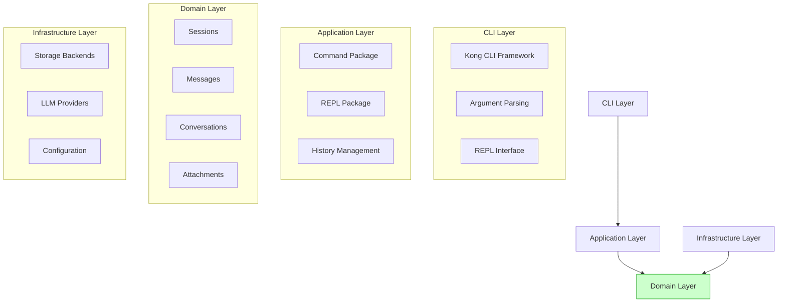
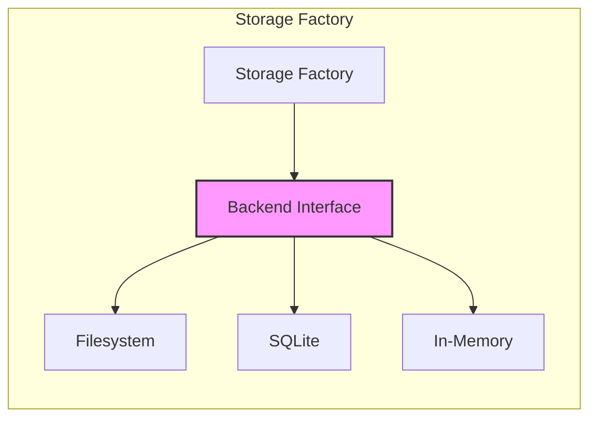
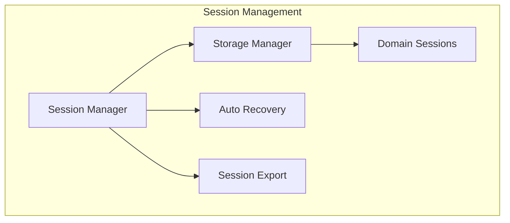
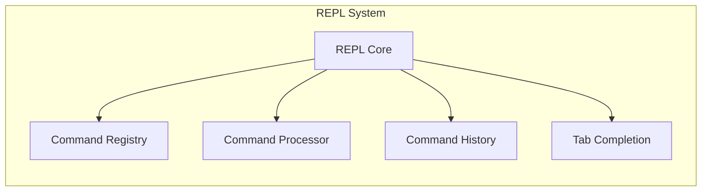
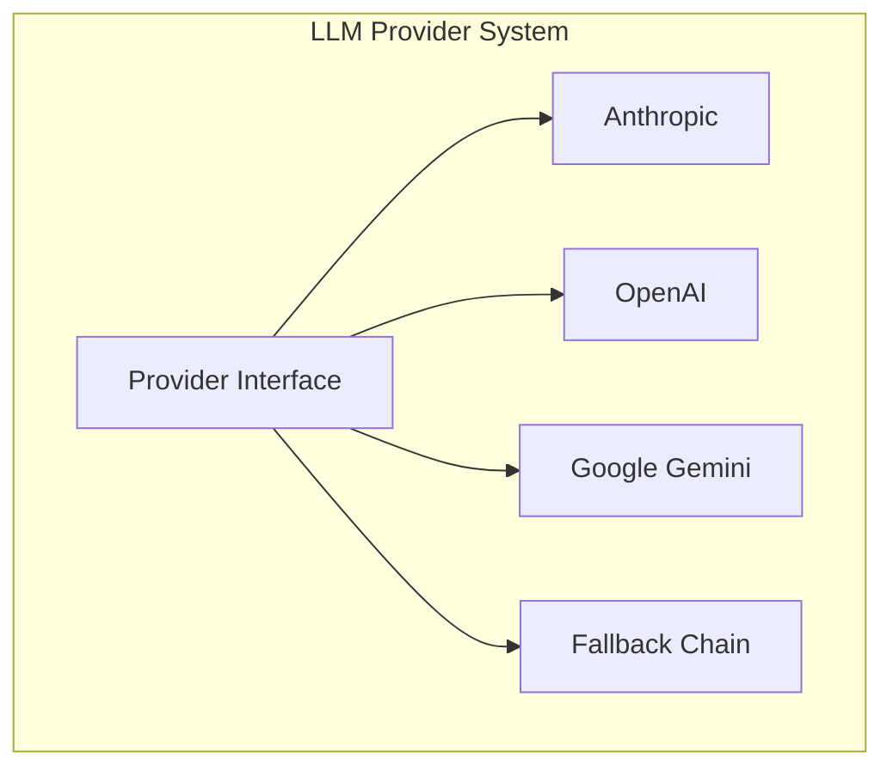
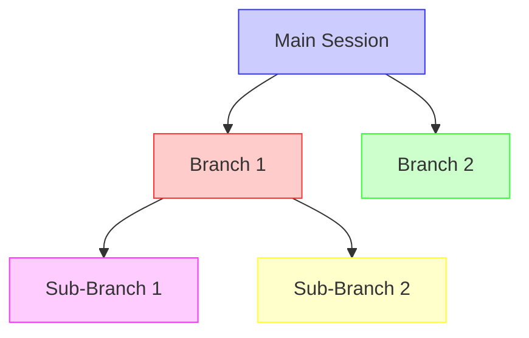
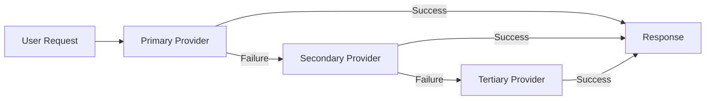
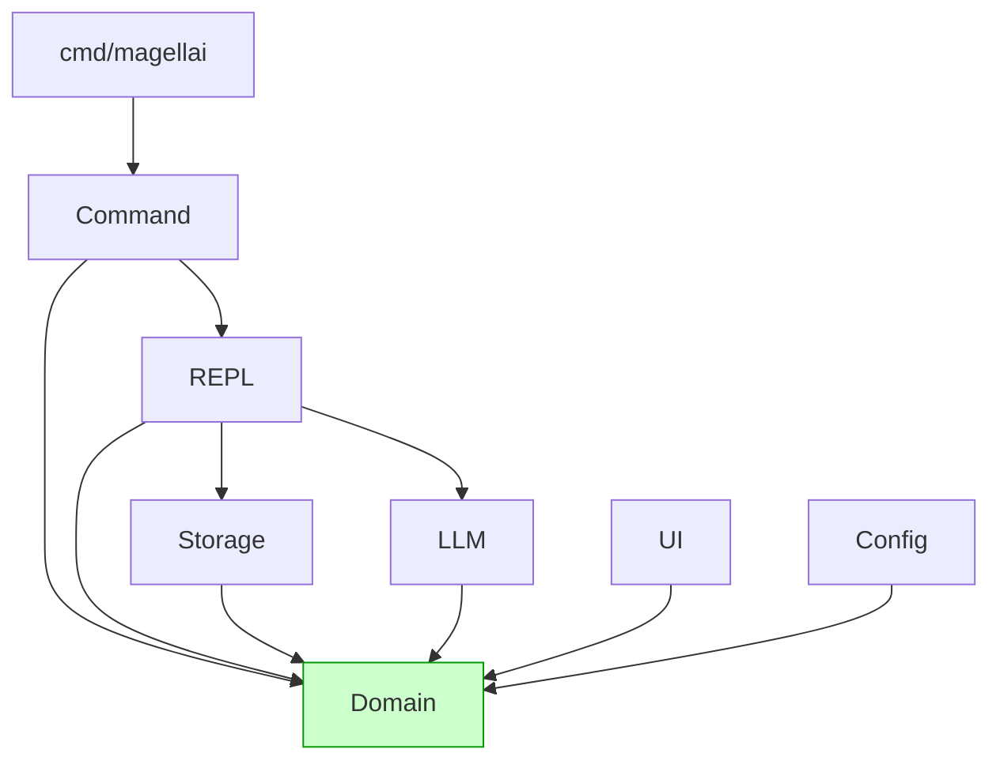

# Magellai Architecture

## System Overview

Magellai is a command-line interface (CLI) tool and REPL for interacting with Large Language Models (LLMs). The architecture follows a library-first design with clean domain-driven principles, ensuring separation of concerns and maintainability.

## Architectural Principles

1. **Library-First Design**: Core functionality implemented as reusable Go packages
2. **Domain-Driven Design**: Clear domain layer with business entities
3. **Clean Architecture**: Separation of concerns between layers
4. **Testability**: Components designed for easy testing
5. **Extensibility**: Plugin architecture for future expansion

## Architecture Layers



### 1. CLI Layer

The outermost layer handles user interactions:
- Command-line argument parsing
- Kong framework integration
- REPL interface management
- User I/O handling

### 2. Application Layer

Implements application logic and use cases:
- Commands implementation
- REPL command processing
- Session history management
- Conversation flow control

### 3. Domain Layer

Contains core business entities and rules:
- Session management
- Message handling
- Conversation operations
- Attachment processing
- Type definitions and enums

### 4. Infrastructure Layer

Provides technical capabilities:
- Storage backends
- LLM provider integrations
- Configuration management
- Logging and instrumentation

## Package Structure

```
magellai/
├── cmd/               # CLI entry points
│   └── magellai/      # Main CLI application
├── internal/          # Private implementation details
│   ├── configdir/     # Configuration directory helpers
│   ├── logging/       # Logging utilities
│   └── testutil/      # Test utilities and mocks
└── pkg/               # Public library packages
    ├── command/       # Command implementation
    │   └── core/      # Core commands (ask, chat, etc.)
    ├── config/        # Configuration management
    ├── domain/        # Domain types and rules
    ├── llm/           # LLM provider integration
    ├── models/        # Model management
    ├── repl/          # REPL implementation
    │   └── session/   # Session management
    ├── replapi/       # REPL public interfaces
    ├── storage/       # Storage backends
    │   ├── filesystem/# File-based storage
    │   └── sqlite/    # SQLite storage
    ├── testutil/      # Test utilities
    └── ui/            # User interface helpers
```

## Domain Model

The domain layer is the central part of the architecture containing all core business entities.

```mermaid
classDiagram
    class Session {
        +ID string
        +Name string
        +Conversation *Conversation
        +Config map[string]interface{}
        +Created time.Time
        +Updated time.Time
        +Tags []string
        +Metadata map[string]interface{}
        +ParentID string
        +BranchPoint int
        +BranchName string
        +ChildIDs []string
        +CreateBranch(branchID, branchName string, messageIndex int) *Session
        +AddMessage(message *Message)
        +ExecuteMerge(source *Session, options MergeOptions) (*Session, *MergeResult)
    }
    
    class Conversation {
        +Messages []*Message
        +AddMessage(message *Message)
        +GetMessageByID(id string) *Message
        +Clone() *Conversation
    }
    
    class Message {
        +ID string
        +Role MessageRole
        +Content string
        +Timestamp time.Time
        +Attachments []Attachment
        +Metadata map[string]interface{}
        +Clone() *Message
    }
    
    class Attachment {
        +ID string
        +Type AttachmentType
        +Data []byte
        +FileName string
        +ContentType string
        +Metadata map[string]interface{}
    }
    
    class SearchResult {
        +Session *SessionInfo
        +Matches []SearchMatch
        +Score float64
    }
    
    class Provider {
        +ID string
        +Name string
        +Type string
        +Models []Model
        +Options map[string]interface{}
    }
    
    Session "1" *-- "1" Conversation
    Conversation "1" *-- "n" Message
    Message "1" *-- "n" Attachment
```

## Key Components

### 1. Storage System

Supports multiple backends:
- Filesystem (JSON files)
- SQLite database
- (Future) Cloud-based storage



### 2. Session Management

Handles session lifecycle and operations:
- Session creation and loading
- Branch management
- Session merging
- Auto-recovery



### 3. REPL System

Interactive command processing:
- Command registry
- Command execution
- Command history
- Tab completion



### 4. LLM Provider System

Unified interface to multiple LLM providers:
- Provider abstraction
- Model management
- Streaming support
- Error handling



## Advanced Features

### Session Branching

The branching system allows users to create alternative conversation paths:



### Session Merging

Supports combining sessions with multiple strategies:
- Continuation merging
- Rebasing
- Cherry-picking

### Provider Fallback

Implements resilient provider chain with automatic fallback:


## Architecture Evolution

The system has evolved through several phases:

1. **Initial Design**: Basic CLI with OpenAI integration
2. **Multi-provider Support**: Added Anthropic, Gemini
3. **Storage Abstraction**: File and SQLite backends
4. **Domain Layer Refactoring**: Consolidated types
5. **Advanced REPL Features**: Commands, history, completion
6. **Session Features**: Branching, merging, search
7. **Error Handling**: Resilient providers, auto-recovery

## Future Architecture Extensions

1. **Plugin System**: Extendable architecture for plugins
2. **Tool Framework**: Integration with external tools
3. **Agent System**: Advanced multi-step reasoning
4. **Workflow Engine**: Composable LLM workflows
5. **Web Interface**: HTTP API and web UI

## Type Ownership

The domain layer owns all core business types, ensuring a single source of truth:

| Type | Owner | Description |
|------|-------|-------------|
| Session | domain | Complete chat session with all data |
| Conversation | domain | Collection of messages |
| Message | domain | Individual chat message |
| Attachment | domain | File or content attached to messages |
| Provider | domain | LLM provider configuration |
| Model | domain | LLM model definition |
| SearchResult | domain | Session search results |

## Package Dependencies



## Interface Contracts

Key interfaces that define the system boundaries:

1. **storage.Backend**: Storage abstraction
2. **domain.SessionRepository**: Session operations
3. **llm.Provider**: LLM provider abstraction
4. **command.Command**: Command interface
5. **repl.REPL**: REPL interface

## Error Handling Strategy

1. **Package-specific Errors**: Each package defines its error types
2. **Consistent Wrapping**: Errors wrapped with context
3. **Error Recovery**: Auto-recovery for transient issues
4. **Graceful Degradation**: Fallback mechanisms

## Testing Strategy

1. **Unit Tests**: Component-level testing
2. **Integration Tests**: Cross-package interaction testing
3. **End-to-End Tests**: Full CLI/REPL testing
4. **Mock Testing**: Using test doubles for external dependencies