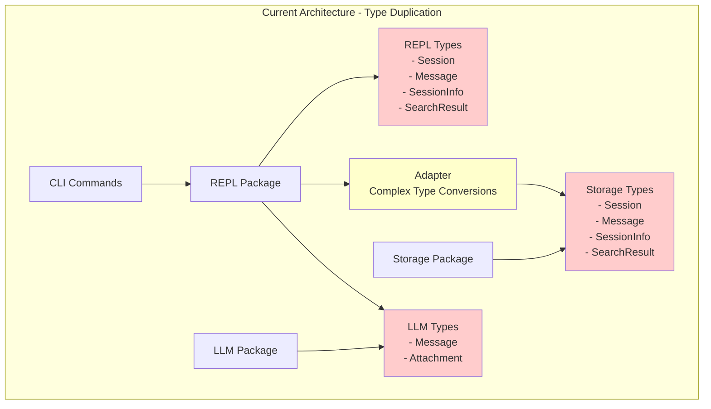
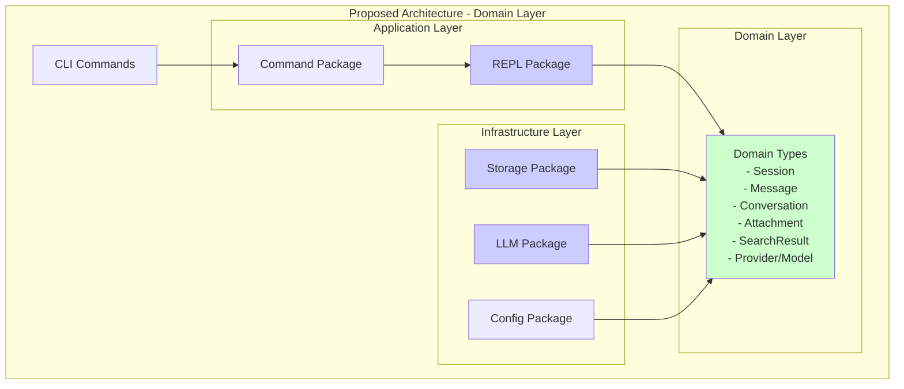
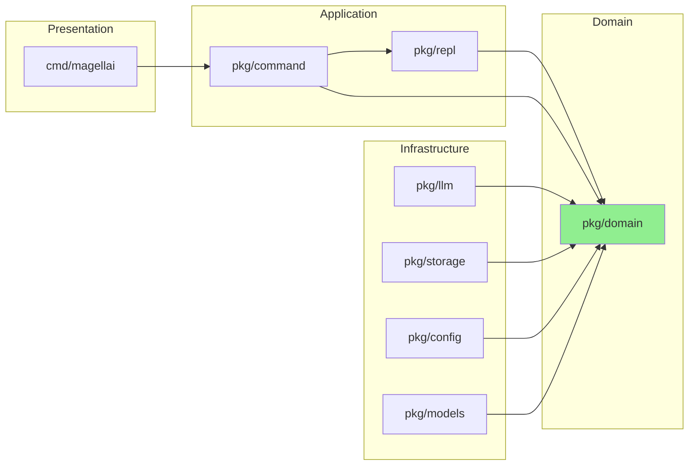

# Domain Layer Architecture

## Current Architecture (Before Refactoring)



## Proposed Architecture (After Refactoring)



## Type Ownership Matrix

| Type | Current Owner(s) | Proposed Owner | Layer |
|------|-----------------|----------------|-------|
| Session | repl, storage | domain | Domain |
| SessionInfo | repl, storage | domain | Domain |
| Message | repl, storage, llm | domain | Domain |
| Attachment | storage, llm | domain | Domain |
| SearchResult | repl, storage | domain | Domain |
| SearchMatch | repl, storage | domain | Domain |
| Conversation | repl | domain | Domain |
| Provider/Model | llm, models | domain | Domain |

## Dependency Flow

### Before Refactoring
```
CLI → REPL ←→ Adapter ←→ Storage
     ↓
    LLM
```

### After Refactoring
```
CLI → REPL → Domain ← Storage
              ↑
             LLM
```

## Package Relationships



## Benefits of Domain Layer

1. **Single Source of Truth**: All business entities defined once
2. **Clear Boundaries**: Infrastructure depends on domain, not vice versa
3. **No Type Conversions**: Direct use of domain types across layers
4. **Better Testing**: Domain logic can be tested in isolation
5. **Easier Maintenance**: Changes to business entities happen in one place

## Migration Path

1. **Phase 1**: Create domain package with all types
2. **Phase 2**: Update storage to use domain types
3. **Phase 3**: Update REPL to use domain types
4. **Phase 4**: Update LLM to use domain types
5. **Phase 5**: Remove adapter layer and test everything

## Code Example

### Before (Duplication)
```go
// pkg/repl/types.go
type Session struct {
    ID           string
    Conversation *Conversation
    // ... fields
}

// pkg/storage/types.go
type Session struct {
    ID       string
    Messages []Message
    // ... similar fields
}

// pkg/repl/adapter.go
func ToStorageSession(replSession *Session) *storage.Session {
    // Complex conversion logic
}
```

### After (Domain Layer)
```go
// pkg/domain/session.go
type Session struct {
    ID           string
    Conversation *Conversation
    // ... single definition
}

// pkg/repl/session_manager.go
func (sm *SessionManager) Save(session *domain.Session) error {
    // Direct use of domain type
}

// pkg/storage/backend.go
type Backend interface {
    SaveSession(session *domain.Session) error
    // Direct use of domain type
}
```