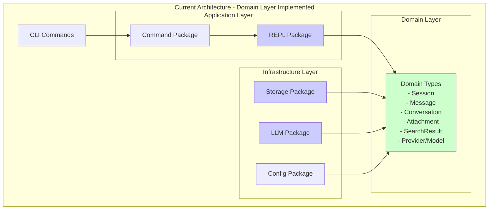

# Domain Layer Architecture

## Implementation Status

As of phase 4.6, the domain layer refactoring has been **partially completed**:

✅ **Completed:**
- Domain package structure created
- All core domain types implemented
- Storage package refactored to use domain types
- SQLite backend updated
- REPL package refactored
- Comprehensive test coverage

🔲 **Pending:**
- Architecture documentation updates
- Package relationship diagrams
- Migration guide for consumers
- Performance verification

## Current Architecture (After Refactoring)



## Type Ownership Matrix

| Type | Owner | Layer | Status |
|------|-------|-------|--------|
| Session | domain | Domain | ✅ Migrated |
| SessionInfo | domain | Domain | ✅ Migrated |
| Message | domain | Domain | ✅ Migrated |
| MessageRole | domain | Domain | ✅ Migrated |
| Attachment | domain | Domain | ✅ Migrated |
| AttachmentType | domain | Domain | ✅ Migrated |
| SearchResult | domain | Domain | ✅ Migrated |
| SearchMatch | domain | Domain | ✅ Migrated |
| Conversation | domain | Domain | ✅ Migrated |
| Provider | domain | Domain | ✅ Migrated |
| Model | domain | Domain | ✅ Migrated |
| ExportFormat | domain | Domain | ✅ Migrated |

## Dependency Flow

### Current Flow (After Refactoring)
```
CLI → Commands → REPL → Domain ← Storage
                          ↑
                         LLM
                          ↑
                       Config
```

## Package Relationships

### Domain Package Structure

```
pkg/domain/
├── session.go      - Core session aggregate root
├── message.go      - Message entities
├── attachment.go   - Multimodal attachment support
├── conversation.go - Conversation management
├── search.go       - Search results types
├── provider.go     - LLM provider/model configuration
├── types.go        - Shared enums and interfaces
└── doc.go         - Package documentation
```

### Package Dependencies

- **CLI Layer**: Depends on Command, REPL
- **Command Layer**: Depends on Domain, REPL
- **REPL Layer**: Depends on Domain, LLM, Storage
- **Storage Layer**: Depends on Domain only
- **LLM Layer**: Has internal types, adapts to Domain when interfacing with other packages
- **Config Layer**: Uses Domain constants and enums

## Migration Impact

### Code Changes Made

1. **Storage Package**:
   - Removed duplicate type definitions
   - Updated all methods to use domain types
   - Removed conversion functions
   - Updated both filesystem and SQLite backends

2. **REPL Package**:
   - Removed duplicate type definitions
   - Updated all imports to use domain types
   - Simplified adapter.go to only handle LLM conversions
   - Updated all commands and managers

3. **LLM Package**:
   - Created adapters between domain and LLM-specific types
   - Maintains internal types for provider-specific needs
   - Handles domain type conversion at boundaries

### Benefits Achieved

1. **Reduced Code Duplication**: Eliminated ~500 lines of duplicate type definitions
2. **Simplified Conversions**: Removed most type conversion functions
3. **Clear Type Ownership**: Single source of truth for business entities
4. **Better Maintainability**: Changes to types only need to be made in one place
5. **Improved Type Safety**: Consistent types across packages

## Testing Strategy

All packages have been updated with comprehensive tests:
- Domain package: Unit tests for all types and methods
- Storage package: Integration tests for both backends
- REPL package: Unit tests for session management
- End-to-end tests: Verify cross-package functionality

## Future Considerations

1. **Performance**: Monitor for any performance impact from the refactoring
2. **Extension Points**: Domain types can be extended with methods as needed
3. **Repository Pattern**: Consider implementing repository interfaces in domain
4. **Event Sourcing**: Domain types are well-positioned for event sourcing if needed
5. **Plugin Support**: Domain types provide stable contracts for plugins