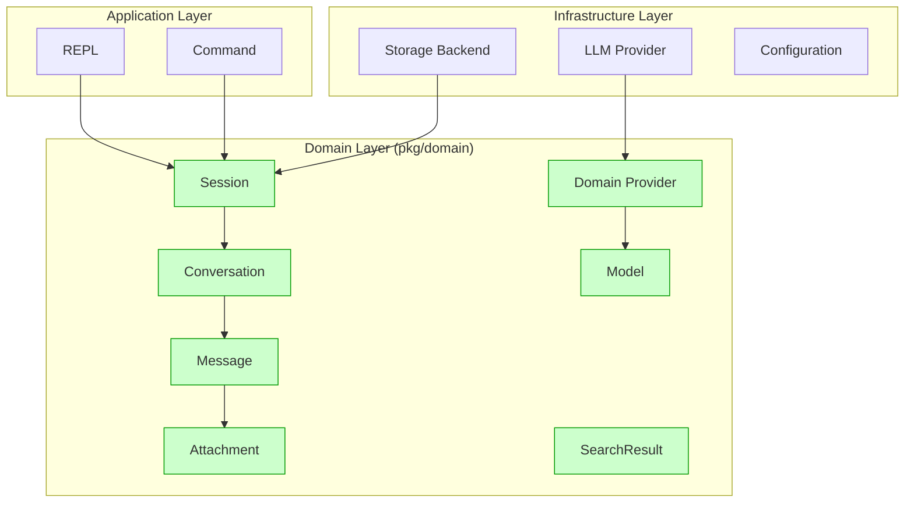

# Type Ownership

## Overview

This document defines the ownership of types across the Magellai codebase, establishing a clear "source of truth" for each concept. Following domain-driven design principles, the domain layer owns all business entity definitions, while technical layers may define adapter types for specific technical needs.

## Core Principles

1. **Single Source of Truth**: Each business concept has one canonical definition
2. **Domain Ownership**: Business entities belong to the domain layer
3. **Adapter Pattern**: Technical layers use adapter types when necessary
4. **Consistent Direction**: Dependencies flow toward the domain, not away from it

## Type Ownership Matrix

| Type | Owner | Layer | Description | 
|------|-------|-------|-------------|
| Session | domain | Domain | Complete chat session with configuration and messages |
| SessionInfo | domain | Domain | Lightweight session summary for listing and searching |
| Message | domain | Domain | Individual message within a conversation |
| MessageRole | domain | Domain | Role of the message sender (user, assistant, system) |
| Conversation | domain | Domain | Collection of ordered messages |
| Attachment | domain | Domain | Media or file attached to a message |
| AttachmentType | domain | Domain | Type of attachment (image, file, etc.) |
| Provider | domain | Domain | LLM provider configuration |
| Model | domain | Domain | LLM model definition |
| SearchResult | domain | Domain | Result from session search operations |
| SearchMatch | domain | Domain | Individual match within search results |
| SessionRepository | domain | Domain | Interface for session storage operations |
| ProviderRepository | domain | Domain | Interface for provider operations |
| Backend | storage | Infrastructure | Storage backend implementation |
| Provider | llm | Infrastructure | Technical provider integration |
| Command | command | Application | Command implementation |
| REPL | repl | Application | REPL implementation |

## Type Relationships



## Adapter Patterns

### 1. LLM Layer Adapters

The `pkg/llm` package uses adapters to convert between domain types and provider-specific types:

```go
// In pkg/llm/adapters.go

// ToProviderMessage converts a domain.Message to a provider-specific message
func ToProviderMessage(msg *domain.Message) ProviderMessage {
    // Conversion logic
}

// FromProviderMessage converts a provider-specific message to a domain.Message
func FromProviderMessage(msg ProviderMessage) *domain.Message {
    // Conversion logic
}
```

### 2. Storage Layer Adapters

Storage implementations convert between domain types and storage-specific representations:

```go
// In pkg/storage/filesystem/filesystem.go

// serializeSession converts a domain.Session to JSON format
func (f *FilesystemBackend) serializeSession(session *domain.Session) ([]byte, error) {
    // Serialization logic
}

// deserializeSession converts JSON data to a domain.Session
func (f *FilesystemBackend) deserializeSession(data []byte) (*domain.Session, error) {
    // Deserialization logic
}
```

## Interface Contracts

The domain layer defines interfaces that must be implemented by infrastructure components:

```go
// In pkg/domain/types.go

// SessionRepository defines the contract for session storage
type SessionRepository interface {
    Create(session *Session) error
    Get(id string) (*Session, error)
    Update(session *Session) error
    Delete(id string) error
    List() ([]*SessionInfo, error)
    Search(query string) ([]*SearchResult, error)
}
```

## Domain Type Evolution

As the system evolves, domain types may need to change. When updating domain types:

1. **Backward Compatibility**: Try to maintain compatibility where possible
2. **Migration Path**: Provide migration tools if changes break compatibility
3. **Interface Stability**: Keep interfaces stable even as internals change
4. **Versioning**: Consider versioning for significant changes

## Examples of Type Usage

### Session Operations

```go
// Create a new session
session := &domain.Session{
    ID:       "session-123",
    Name:     "Example Session",
    Created:  time.Now(),
    Updated:  time.Now(),
    Tags:     []string{"example", "demo"},
    Metadata: map[string]interface{}{"source": "api"},
}

// Add a message
message := &domain.Message{
    ID:        "msg-1",
    Role:      domain.MessageRoleUser,
    Content:   "Hello, world!",
    Timestamp: time.Now(),
}
session.Conversation.AddMessage(message)

// Save to storage
err := repository.Create(session)
```

### Provider Configuration

```go
// Define a provider
provider := &domain.Provider{
    ID:   "anthropic-1",
    Name: "Anthropic",
    Type: "anthropic",
    Models: []domain.Model{
        {
            ID:   "claude-3-opus",
            Name: "Claude 3 Opus",
            Capabilities: []domain.ModelCapability{
                domain.ModelCapabilityChat,
                domain.ModelCapabilityMultimodal,
            },
        },
    },
    Options: map[string]interface{}{
        "api_key": "env:ANTHROPIC_API_KEY",
    },
}
```

## Benefits of Clear Type Ownership

1. **Reduced Duplication**: Eliminate duplicate type definitions
2. **Simplified Maintenance**: Changes only need to be made in one place
3. **Improved Type Safety**: Consistent types across packages
4. **Clear Dependencies**: Well-defined dependency direction
5. **Better Architecture**: Following domain-driven design principles

## Future Considerations

1. **Repository Pattern**: Domain types define repositories but don't implement them
2. **Value Objects**: Consider making immutable value objects for certain types
3. **Aggregate Roots**: Session serves as an aggregate root for related entities
4. **Domain Events**: Consider adding event publishing for domain changes
5. **Validation Rules**: Embed validation within domain entities